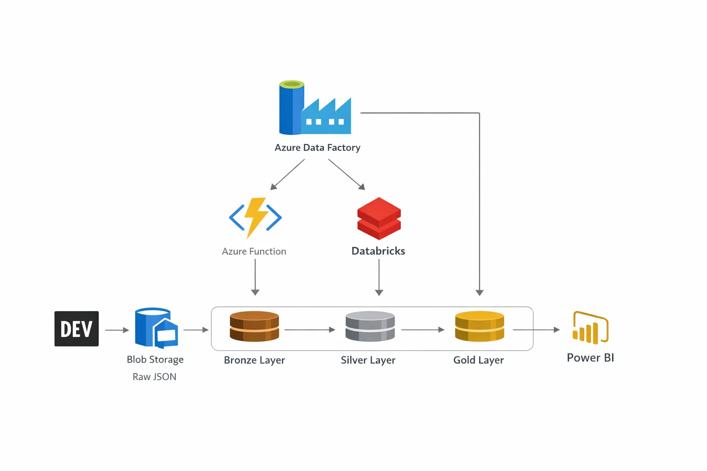
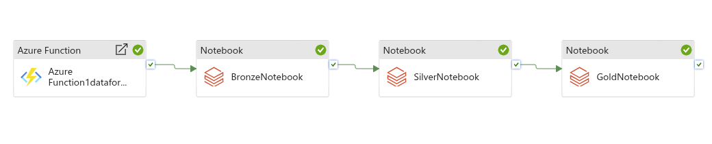

## Forem ELT Pipeline

### Project Goal

This project builds an **end-to-end Lakehouse pipeline (ELT)** to analyze technical articles published on `dev.to` platform, focusing on questions like:

- Which articles are more popular (beginner, tutorials, discussions)?
- What keywords and tags trend over time?
- Which metrics impact engagement (reading time, sentiment, etc.)?

**Data Overview:**
- Total Articles Collected: over 1 000 000 unique articles
- Time Period: Historical backfill + daily incremental updates, data span period 01/2023-01/2026

---

### Architecture

**Source → Storage → Processing → Analytics**

Orchestration is handled by Azure Data Factory:

---

### Pipeline Description:

**Extract**

- Articles are fetched from **`dev.to` (Forem) REST API** via Python scripts running in an **Azure Function App** ([view](https://github.com/eremina-official/azure-func-forem-data) project on GitHub).
- Initial historical backfill is loaded once, subsequent loads capture only new articles.

**Load**

- Raw JSON is stored directly in **Azure Blob Storage**.
- Processed data is stored in **Delta tables**, organized into Bronze, Silver and Gold layers following the Medallion Architecture pattern.

**Transform**

- Data transformations are implemented in **Databricks** using **PySpark**. 
- Transformations are splitted into notebooks for each layer (Bronze, Silver, Gold) to maintain separation of concerns and facilitate maintenance.

**Orchestration (Azure Data Factory)**

- **Azure Data Factory** triggers the Azure Function App for incremental article ingestion.
- Orchestrates Databricks notebooks for data transformations.
- Ensures pipeline runs in a scheduled, automated and auditable way.

**Analytics (Power BI)**

- Gold tables are used by Power BI dashboards for interactive exploration.
- Data points are created in **Databricks SQL Warehouse** for efficient data loading/querying by Power BI.
- Power BI data model implements **star schema** design for performance, with fact tables for article metrics and dimension tables for tags, user data, DateTable etc.

---

### Data Layers

**Data Source** 

Raw JSON data is fetched using **Forem REST API** `https://dev.to/api/articles/latest` and stored in **Azure Blob Storage**. Raw data is never modified or deleted to preserve the original state for traceability and reprocessing if needed.

🥉 **Bronze**

Raw JSON is ingested as-is into Delta Lake without any transformations. This layer serves as the **immutable source of truth**, allowing for reprocessing and schema evolution as needed.

***Engineering Decisions:***

- Add metadata columns (ingestion timestamp, source) for traceability
- No transformations or cleaning at this stage to maintain data integrity
- Stored as Delta format (efficient querying, schema evolution, reduced storage costs)
- Supports append-based incremental loads
- Partitioned by year/month/day for efficient querying and management

🥈 **Silver**

Transformed and cleaned data optimized for analysis. Key transformations include:

- Deduplicated by id
- Filtered empty articles (reading time > 0)
- Flattened nested structures (e.g., tags, user info)
- Added derived columns for analytical purposes (year, month)
- Selected relevant columns for downstream analysis

***Engineering Decisions:***

- One row per article (normalized structure)
- Exploded tag table created separately for tag-level analytics
- Avoid mixing aggregation logic in Silver

🥇 **Gold**

Analytical tables optimized for BI. Main tables include:

- articles_fact (articles stats for overall trends and engagement analysis)
- tags_fact (exploded tags with counts by month/year for trend analysis)
- titles (for title keywords analysis)

***Engineering Decisions:***

- Only business-ready aggregates stored here
- Designed for Power BI performance
- Explode tags in Gold for easier analysis

---

### Key Engineering Decisions

- **Medallion Architecture**: Clear separation of raw, cleaned and business-ready data layers for maintainability and scalability.
- **ELT Pattern**: Extract → Load → Transform, with raw data preserved for reproducibility and traceability.
- **Incremental Loads**: Pipeline designed for efficiency, only new articles are processed daily.
- **Metadata** to keep track of processed batches (processed batches information is stored for the bronze and silver layer in a separate table).
- **Delta Lake** for storage: provides ACID transactions, schema evolution and efficient querying.
- **Modular Transformations**: Separate notebooks for each layer to maintain separation of concerns and facilitate maintenance.
- **Power BI Optimization**: Gold tables designed for performance and ease of use in Power BI dashboards.

---

### Cost of Azure Services

- **Azure Functions**: Pay-per-use model, costs depend on execution time and memory. Estimated cost for this project is minimal due to short execution times and infrequent runs (daily).

- **Azure Blob Storage**: Costs based on storage volume and access patterns. With over 1 million articles, estimated storage costs are moderate, especially with infrequent access to raw data.

- **Azure Databricks**: Costs depend on cluster size and runtime. **For this project cost of Databricks was highest among all services.**

- **Azure Data Factory**: Costs based on pipeline runs and data movement. With daily runs, estimated costs are manageable, especially with efficient pipeline design to minimize unnecessary runs.

- **Power BI**: Costs depend on the number of users and data refresh frequency. For this projects, desktop version of Power BI is used, data were loaded to Power BI using Import Mode.
